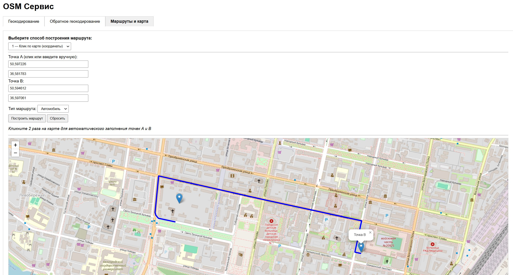

# OSM Сервис: Геокодирование, Поиск и Маршруты

Микросервис на FastAPI для работы с открытыми геоданными:

- Прямое и обратное геокодирование через **Nominatim**
- Поиск объектов в заданной области через **Overpass API**
- Построение маршрутов с помощью **OSRM**
- Визуализация на **интерактивной карте (Leaflet + Folium)**

  

---

## Установка и запуск

### 1. Клонируйте репозиторий

```bash
git clone https://github.com/AntonSHBK/osm_example.git
cd osm_example
```

### 2. Запуск через Docker

```bash
docker-compose up --build
```

Откроется на [http://127.0.0.1:8000/](http://127.0.0.1:8000/)

Для тестирования API можно использовать [**Swagger UI**](http://127.0.0.1:8000/docs), который доступен по следующему адресу:

```bash
http://127.0.0.1:8000/docs
```

---

## Структура проекта

```
osm-service/
├── app/                    # Основной код
│   ├── routers/            # Эндпоинты FastAPI
│   ├── services/           # Взаимодействие с внешними API
│   ├── models/             # Pydantic-модели
│   ├── static/             # JS/CSS
│   ├── templates/          # HTML-шаблоны
│   └── utils/              # Логирование, вспом. функции
├── data/                   # Кешированные данные / GeoJSON (пока там ничего нет, но может понадобится)
├── notebooks/              # Тесты и примеры (пока там ничего нет, но может понадобится)
├── docker/                 # Dockerfile и docker-compose.yml
└── README.md
```

---

## Используемые API

| API          | Назначение                     | Без токенов |
|--------------|--------------------------------|-------------|
| Nominatim    | Прямое и обратное геокодирование | ✅          |
| Overpass API | Поиск объектов по тегам        | ✅          |
| OSRM         | Построение маршрута            | ✅          |

---

## API Эндпоинты

### 🔹 1. Геокодирование (адрес → координаты)

```http
GET /geocode?q=Москва, Кремль
```

**Пример ответа:**

```json
{
  "lat": "55.752023",
  "lon": "37.617499",
  "display_name": "Москва, Кремль, Россия"
}
```

---

### 🔹 2. Обратное геокодирование (координаты → адрес)

```http
GET /reverse-geocode?lat=55.75&lon=37.61
```

---

### 🔹 3. Поиск объектов в bbox

```http
GET /search?bbox=36.55,50.62,36.63,50.57&tag=school
```

**Параметры:**
- `bbox` — `left,top,right,bottom`
- `tag` — Overpass-тег (например `school`, `park`, `hospital`)

---

### 🔹 4. Построение маршрута по координатам

```http
GET /map?from_lat=50.63&from_lon=36.56&to_lat=50.64&to_lon=36.57&mode=car
```

**Результат:** HTML-страница с картой, точками и маршрутом.

---

### 🔹 5. Построение маршрута по клику / координатам

```http
GET /map/interactive-data?from_lat=...&from_lon=...&to_lat=...&to_lon=...&mode=foot
```

---

### 🔹 6. Построение маршрута по названиям

```http
GET /map/from-names?from=Белгород, вокзал&to=БелГУ&mode=car
```

---

## Визуализация UI

Открой в браузере:

```
http://127.0.0.1:8000/
```

Там доступны:

- Геокодирование (адрес → координаты)
- Обратное геокодирование
- Построение маршрута тремя способами:
  1. 🖱 Клик по карте
  2. ⌨️ Ввод координат
  3. 🔍 Ввод названий объектов  
- Отображение всех результатов на одной интерактивной карте (Leaflet)

---

## 🧰 Требования (если без Docker)

- Python 3.11+
- `pip install -r requirements.txt`
- Запуск:
  ```bash
  uvicorn app.main:app --reload
  ```

---

## 📄 Лицензия

MIT License